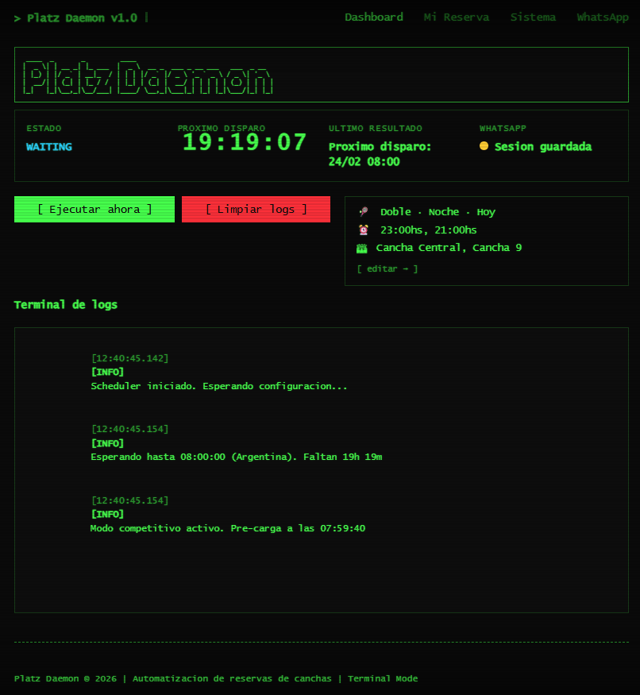
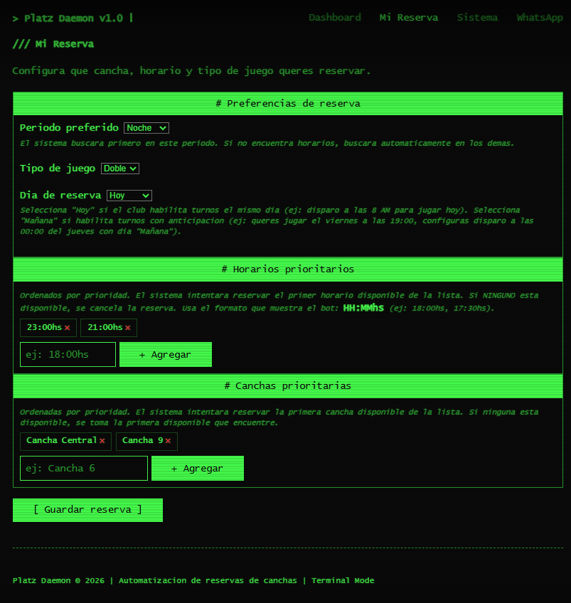
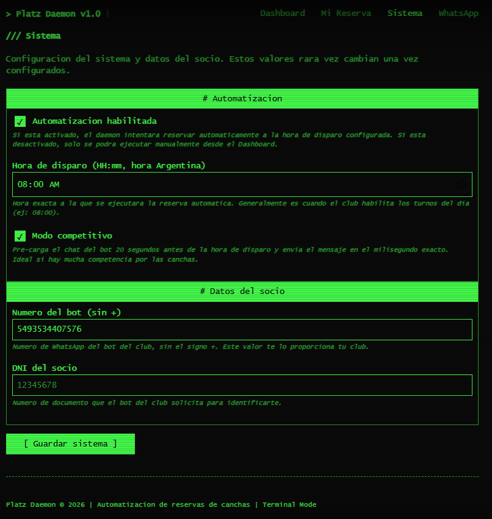
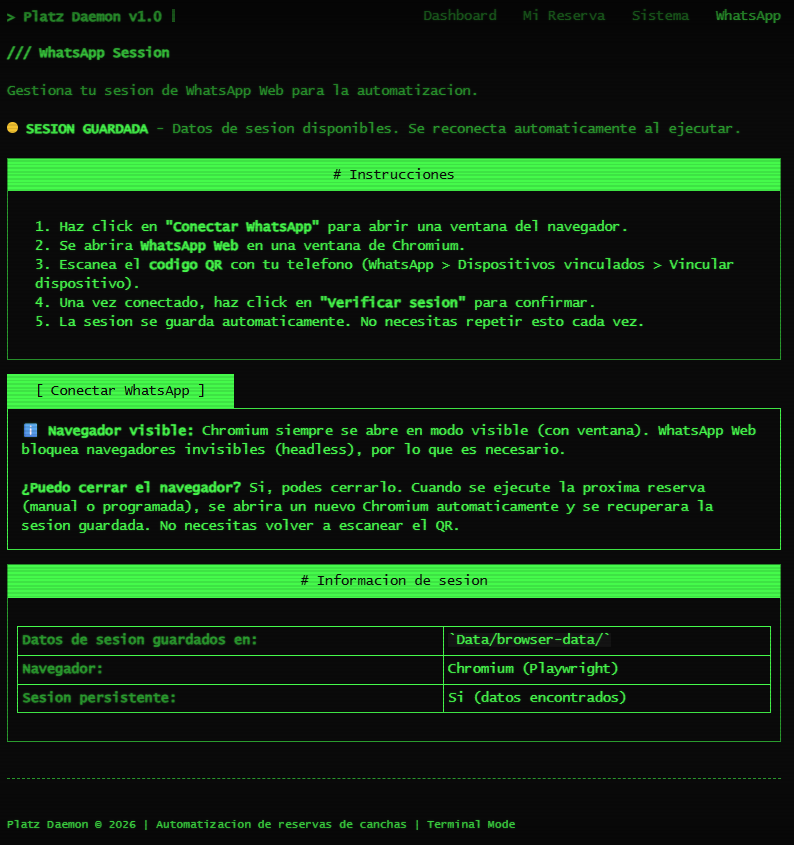

<p align="center">
  
</p>

<h1 align="center">Platz Daemon</h1>

<p align="center">
  <strong>Automatización de reservas de canchas de tenis vía WhatsApp</strong>
</p>

<p align="center">
  
  
  
  
  
  
</p>

Platz Daemon es una aplicación de escritorio que automatiza el proceso de reserva de canchas de tenis a través del bot de WhatsApp de tu club. Se ejecuta como un servidor local con interfaz web retro estilo terminal de los '90.

---

## ¿Para qué sirve?

Si tu club de tenis utiliza un bot de WhatsApp para reservar canchas y los turnos se habilitan a una hora específica (ej: 8:00 AM), Platz Daemon se encarga de:

1. **Esperar** hasta la hora exacta en que se habilitan los turnos.
2. **Enviar** automáticamente los mensajes al bot de WhatsApp.
3. **Seleccionar** el horario, cancha y tipo de juego que configuraste.
4. **Confirmar** la reserva por vos.

Ya no necesitás despertarte a las 8 AM ni competir manualmente por las canchas.

---

## 🖥️ Interfaz

La aplicación tiene 4 pantallas, todas con estética retro de terminal verde sobre negro.

### Dashboard (`/`)

Panel principal con estado del daemon, cuenta regresiva al próximo disparo, resumen de la reserva configurada y terminal de logs en tiempo real.

<p align="center">
  
</p>

<details>
<summary><strong>Mi Reserva</strong> (<code>/config</code>) — Configuración de la reserva</summary>
<br>

Periodo preferido, tipo de juego, día de reserva, horarios prioritarios y canchas prioritarias (ordenados por prioridad).

<p align="center">
  
</p>
</details>

<details>
<summary><strong>Sistema</strong> (<code>/sistema</code>) — Configuración del sistema</summary>
<br>

Automatización habilitada/deshabilitada, hora de disparo, modo competitivo, número del bot de WhatsApp y DNI del socio.

<p align="center">
  
</p>
</details>

<details>
<summary><strong>WhatsApp</strong> (<code>/session</code>) — Gestión de sesión</summary>
<br>

Conexión y verificación de WhatsApp Web, instrucciones para escanear el QR e información de la sesión guardada.

<p align="center">
  
</p>
</details>

---

## 📥 Descarga e instalación (no se necesita instalar nada)

> **Para usuarios que solo quieren usar la app.** No necesitás saber programar ni instalar herramientas. Solo seguí estos pasos.

### Paso 1 — Descargar

1. Entrá a la página de **Releases** del proyecto: [click acá para ir a Releases](../../releases/latest).
2. En esa página, bajá hasta la sección **Assets** (está abajo de todo).
3. Descargá el archivo correspondiente a tu sistema operativo:
   - **Windows**: `PlatzDaemon-win-x64-v*.*.*.zip`
   - **Linux**: `PlatzDaemon-linux-x64-v*.*.*.tar.gz`
   - **macOS**: `PlatzDaemon-osx-arm64-v*.*.*.tar.gz`

> 💡 **¿Qué es esa página?** Es simplemente la página de descarga del programa. El archivo contiene todo lo necesario para ejecutarlo.

### Paso 2 — Extraer

**Windows**: click derecho sobre el ZIP → **"Extraer todo..."** → Elegí una carpeta (ej: `C:\PlatzDaemon`).

**Linux / macOS**: `tar -xzf PlatzDaemon-*.tar.gz -C ~/PlatzDaemon`

### Paso 3 — Ejecutar

1. Abrí la carpeta que extrajiste.
2. Ejecutá el binario:
   - **Windows**: doble click en **`PlatzDaemon.exe`**.
   - **Linux / macOS**: `./PlatzDaemon` desde la terminal.

> ⚠️ **Windows**: puede mostrar una advertencia de SmartScreen ("Windows protegió tu equipo"). Hacé click en **"Más información"** → **"Ejecutar de todas formas"**. Solo pasa la primera vez.
>
> ⚠️ **macOS**: puede bloquear la ejecución. Andá a **Preferencias del Sistema > Seguridad** y hacé click en **"Abrir de todos modos"**.

3. Se va a abrir una **ventana de consola** (es normal, no la cierres) y automáticamente se abre tu **navegador** con la interfaz de Platz Daemon.

> 🕐 **Primera ejecución**: la primera vez que conectes WhatsApp, la app descarga automáticamente el navegador Chromium (~100 MB). Esto tarda unos segundos dependiendo de tu conexión. Solo pasa una vez.

> 🌐 Si el navegador no se abre solo, abrí manualmente **http://localhost:5000** en Chrome, Edge, Firefox, o el navegador que uses.

### Paso 4 — Conectar tu WhatsApp

1. En la interfaz web, andá a la pestaña **"WhatsApp"**.
2. Hacé click en **"Conectar WhatsApp"** → se abre una ventana de navegador con WhatsApp Web.
3. En tu **celular**, abrí WhatsApp → ⋮ Menú → **"Dispositivos vinculados"** → **"Vincular un dispositivo"**.
4. Escaneá el **código QR** que aparece en la pantalla.
5. Esperá unos segundos y hacé click en **"Verificar sesión"** para confirmar.

> ✅ La sesión se guarda. **No necesitás escanear el QR cada vez** que abrís la app.
>
> 🖥️ **Nota**: al ejecutar la reserva, se abre una ventana de **Chromium** (es necesario, WhatsApp bloquea navegadores invisibles). Podés cerrarla si querés; se re-abre sola la próxima vez.

### Paso 5 — Configurar tu reserva

1. Ir a **"Mi Reserva"**: elegí tu periodo preferido (Mañana/Tarde/Noche), los horarios que querés, las canchas preferidas y el tipo de juego.
2. Ir a **"Sistema"**: poné tu DNI, el número del bot de WhatsApp del club, la hora a la que se habilitan los turnos, y si querés activar el modo competitivo.
3. Hacé click en **"Guardar"** en cada sección.

### Paso 6 — ¡Listo!

Dejá la computadora prendida (no suspendida). El programa se va a encargar de reservar la cancha automáticamente a la hora que configuraste. Podés ver el estado en tiempo real en el **Dashboard**.

> ⚠️ **Importante**: asegurate de que tu PC **no entre en suspensión automática**. Si la PC se suspende, el programa se detiene y no va a poder reservar.
> - **Windows**: Configuración > Sistema > Energía y suspensión → "Nunca".
> - **Linux**: `systemd-inhibit --what=idle sleep` o configurar desde las opciones de energía.
> - **macOS**: Ajustes del Sistema > Pantalla de bloqueo → desactivar suspensión automática.

> 💡 **Tip**: podés cerrar la pestaña del navegador tranquilo, el programa sigue corriendo. Podés volver a entrar a **http://localhost:5000** cuando quieras para ver cómo va. Lo que **no** tenés que cerrar es la ventana de consola negra.
>
> 🖥️ **Sobre la ventana de Chromium**: cuando se ejecuta la reserva, se abre una ventana de Chromium automáticamente. Si la cerrás, no pasa nada: se vuelve a abrir sola en la próxima ejecución. No perdés la sesión de WhatsApp.

### Resumen rápido

| Qué hacer | Cómo |
|---|---|
| **Descargar** | Ir a Releases → descargar para tu plataforma |
| **Instalar** | No se instala nada, solo extraer |
| **Ejecutar** | `PlatzDaemon.exe` (Win) / `./PlatzDaemon` (Linux/macOS) |
| **Configurar** | Desde el navegador en `http://localhost:5000` |
| **Parar la app** | Cerrar la consola (o `Ctrl+C`) |

---

## 🔧 Para desarrolladores

> Las secciones siguientes son para usuarios técnicos que quieran compilar, modificar o contribuir al proyecto.
>
> 📚 **Documentación técnica completa**: si querés entender la arquitectura, los servicios, el flujo de reserva, Playwright, o cómo modificar el código, consultá **[docs/](docs/)** — documentación estilo DeepWiki pensada para desarrolladores.

### Requisitos de desarrollo

- **Windows 10+**, **Linux** o **macOS**
- **.NET 10 SDK** ([descargar](https://dotnet.microsoft.com/download))
- **WhatsApp** vinculado a tu teléfono
- Conexión a internet estable

### Compilar y ejecutar desde el código fuente

#### 1. Clonar e instalar dependencias

```bash
git clone <url-del-repositorio>
cd PlatzDaemon
dotnet build
```

#### 2. Instalar navegador de Playwright

```bash
pwsh bin/Debug/net10.0/playwright.ps1 install chromium
```

Si no tenés `pwsh`, usá `powershell` (Windows):

```powershell
powershell -ExecutionPolicy Bypass -File bin/Debug/net10.0/playwright.ps1 install chromium
```

#### 3. Ejecutar la aplicación

```bash
dotnet run
```

La aplicación se abre en `http://localhost:5000`.

### Tests

El proyecto usa **xUnit** con **NSubstitute** para mocking. Los tests cubren modelos, servicios y páginas.

```bash
# Correr todos los tests
dotnet test

# Correr tests con reporte de cobertura
dotnet test --collect:"XPlat Code Coverage" --settings coverage.runsettings --results-directory ./coverage

# Generar reporte HTML (requiere reportgenerator)
dotnet tool install -g dotnet-reportgenerator-globaltool
reportgenerator -reports:"coverage/**/coverage.cobertura.xml" -targetdir:"coverage/report" -reporttypes:Html
```

El reporte HTML se genera en `coverage/report/index.html`.

> 💡 Los tests se ejecutan automáticamente en GitHub Actions en cada push a `main` y en cada pull request. También se ejecutan antes de crear un Release.

### Publicar ejecutable

Para generar un ejecutable distribuible (self-contained, no requiere .NET instalado):

```bash
# Windows
dotnet publish -c Release -r win-x64 --self-contained true /p:PublishSingleFile=true

# Linux
dotnet publish -c Release -r linux-x64 --self-contained true /p:PublishSingleFile=true

# macOS (Apple Silicon)
dotnet publish -c Release -r osx-arm64 --self-contained true /p:PublishSingleFile=true
```

El resultado queda en `bin/Release/net10.0/<rid>/publish/`. Para distribuir, comprimir esa carpeta y subirla a GitHub Releases.

### Crear un Release en GitHub (automático)

El proyecto incluye un **GitHub Action** que compila y publica el EXE automáticamente. Solo tenés que crear un tag:

```bash
git tag v1.0.0
git push origin v1.0.0
```

Esto dispara el workflow `.github/workflows/release.yml` que:
1. Ejecuta todos los tests.
2. Compila el proyecto para **Windows**, **Linux** y **macOS** en paralelo.
3. Genera ejecutables self-contained para cada plataforma.
4. Los empaqueta (`.zip` para Windows, `.tar.gz` para Linux/macOS).
5. Crea el Release en GitHub con los binarios de las 3 plataformas.

Para la próxima versión: `git tag v1.1.0 && git push origin v1.1.0`, y así.

> 💡 También podés crear un Release manual desde GitHub: pestaña **"Releases"** → **"Draft a new release"** → subir el ZIP manualmente.

---

## Estructura del proyecto

```
PlatzDaemon/
├── .github/workflows/        # GitHub Actions
│   ├── ci.yml                # CI: build + tests + coverage
│   └── release.yml           # Build, test & publish automático
├── Pages/                    # Páginas Razor (UI)
│   ├── Index.cshtml          # Dashboard con logs en tiempo real
│   ├── Config.cshtml         # Configuración "Mi Reserva"
│   ├── Sistema.cshtml        # Configuración del sistema
│   └── Session.cshtml        # Gestión de sesión WhatsApp
├── Services/                 # Lógica de negocio
│   ├── WhatsAppAutomationService.cs  # Automatización con Playwright
│   ├── BookingSchedulerService.cs    # Scheduler (BackgroundService)
│   ├── ConfigStore.cs                # Persistencia de configuración
│   ├── IConfigStore.cs               # Interfaz para testing
│   ├── LogStore.cs                   # Almacén de logs + SignalR
│   └── AppStateService.cs           # Estado de la aplicación
├── Models/                   # Modelos de datos
│   ├── BookingConfig.cs      # Modelo de configuración
│   ├── AppState.cs           # Estado del daemon
│   └── LogEntry.cs           # Entrada de log
├── Hubs/
│   └── LogHub.cs             # Hub de SignalR para logs en tiempo real
├── PlatzDaemon.Tests/        # Tests (xUnit + NSubstitute)
│   ├── Models/               # Tests de modelos
│   ├── Services/             # Tests de servicios
│   └── Pages/                # Tests de páginas
├── Data/                     # (gitignored)
│   ├── config.json           # Configuración persistida
│   └── browser-data/         # Datos de sesión del navegador
├── wwwroot/
│   ├── css/
│   │   ├── terminal.min.css  # terminal.css (tema retro)
│   │   └── site.css          # Estilos personalizados
│   └── js/
│       └── site.js           # JavaScript del cliente
├── PlatzDaemon.slnx          # Solution (incluye app + tests)
├── PlatzDaemon.csproj        # Proyecto .NET
├── coverage.runsettings      # Config de cobertura
├── Program.cs                # Entry point
├── README.md
└── DOCS.md
```

---

## Tecnologías

| Tecnología | Uso |
|---|---|
| **ASP.NET Core Razor Pages** | Interfaz web y servidor |
| **Playwright** | Automatización del navegador Chromium |
| **SignalR** | Logs y estado en tiempo real |
| **terminal.css** | UI retro estilo terminal |
| **BackgroundService** | Scheduler para ejecución programada |
| **xUnit + NSubstitute** | Testing y mocking |

---

## Documentación completa

Consultá **[DOCS.md](DOCS.md)** para la documentación detallada que incluye:

- Guía completa de configuración
- Flujo de automatización paso a paso
- Modo competitivo
- Manejo de errores y reintentos
- Preguntas frecuentes
- Troubleshooting

---

## Licencia

Uso personal. Diseñado para automatizar reservas en clubes de tenis que usan bots de WhatsApp.
