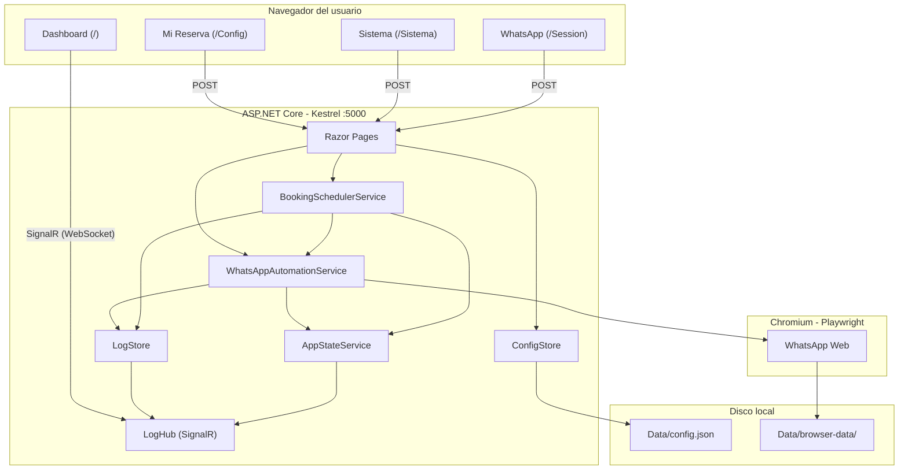
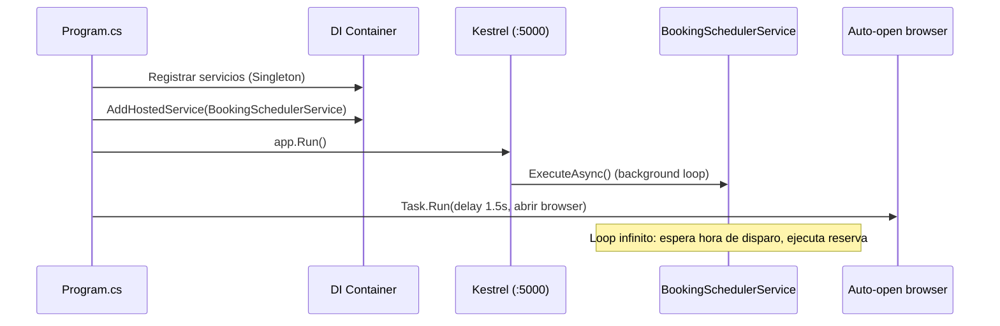
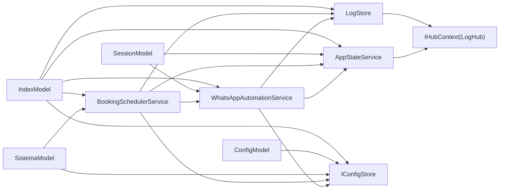

# Arquitectura

## Vision general

Platz Daemon es una aplicacion ASP.NET Core Razor Pages que corre como servidor local en `http://localhost:5000`. Tiene dos responsabilidades paralelas:

1. **Servir una interfaz web** (Razor Pages + SignalR) para que el usuario configure y monitoree la reserva.
2. **Ejecutar un daemon en background** (`BackgroundService`) que, a la hora configurada, automatiza la reserva de canchas a traves de WhatsApp Web usando Playwright.

No hay base de datos. La configuracion se persiste en un archivo JSON (`Data/config.json`) y la sesion de WhatsApp se guarda en el directorio de datos del navegador (`Data/browser-data/`).

---

## Diagrama del sistema



---

## Ciclo de vida de la aplicacion

Todo arranca en `Program.cs`:



### Registro de servicios

Todos los servicios se registran como **Singleton** en el contenedor de DI:

```csharp
builder.Services.AddSingleton<ConfigStore>();
builder.Services.AddSingleton<IConfigStore>(sp => sp.GetRequiredService<ConfigStore>());
builder.Services.AddSingleton<LogStore>();
builder.Services.AddSingleton<AppStateService>();
builder.Services.AddSingleton<WhatsAppAutomationService>();
builder.Services.AddSingleton<BookingSchedulerService>();
builder.Services.AddHostedService(sp => sp.GetRequiredService<BookingSchedulerService>());
```

Se usa Singleton porque:

- Los servicios mantienen **estado compartido** (config cacheada, logs en memoria, estado del daemon, instancia del browser).
- Hay **una sola instancia** del navegador Chromium y un solo scheduler corriendo.
- Las Razor Pages necesitan acceder al mismo estado que el background service.

`ConfigStore` se registra dos veces: una como clase concreta (para que otros servicios la resuelvan) y otra como `IConfigStore` (interfaz para testing/mocking).

`BookingSchedulerService` tambien se registra dos veces: como singleton (para que las Razor Pages lo inyecten y llamen a `TriggerManualRunAsync`) y como hosted service (para que ASP.NET Core lo arranque automaticamente).

---

## Grafo de dependencias



---

## Flujo de datos

### Configuracion

```
Usuario (browser)
  → POST /Config o /Sistema
    → ConfigModel/SistemaModel (merge parcial)
      → ConfigStore.SaveAsync()
        → Data/config.json (disco)
```

Cada pagina solo actualiza **sus campos** del modelo `BookingConfig` sin sobreescribir los de la otra pagina. Esto es el "merge parcial": cargan el config completo, modifican solo lo suyo, y guardan.

### Logs y estado en tiempo real

```
WhatsAppAutomationService / BookingSchedulerService
  → LogStore.LogAsync("mensaje", nivel)
    → Agrega a lista en memoria (max 500)
    → IHubContext<LogHub>.Clients.All.SendAsync("ReceiveLog", ...)
      → SignalR WebSocket
        → JavaScript del Dashboard: crea <div> en la consola de logs

  → AppStateService.UpdateStatusAsync(status, result)
    → Actualiza AppState en memoria
    → IHubContext<LogHub>.Clients.All.SendAsync("StatusUpdate", ...)
      → SignalR WebSocket
        → JavaScript del Dashboard: actualiza status, resultado, countdown
```

### Automatizacion

```
BookingSchedulerService (hora de disparo)
  → WhatsAppAutomationService.ExecuteBookingAsync()
    → Playwright: abre/reutiliza Chromium
      → Navega a WhatsApp Web
        → Envia mensajes al bot
          → Selecciona opciones (dia, periodo, horario, cancha, tipo)
            → Confirma reserva
```

---

## Patrones clave

### Concurrencia

- `WhatsAppAutomationService` usa un `SemaphoreSlim(1, 1)` para serializar acceso al browser. Solo una operacion de automatizacion puede ejecutarse a la vez.
- `ConfigStore` usa un `SemaphoreSlim(1, 1)` para serializar escrituras al archivo JSON.
- `LogStore` y `AppStateService` usan `lock` (via `Lock`) para proteger su estado interno.

### Comunicacion real-time

SignalR con un unico hub (`LogHub`) que transmite dos tipos de eventos:
- `ReceiveLog`: nuevos logs (tiempo, prefijo, mensaje, CSS class).
- `StatusUpdate`: cambios de estado (status, resultado, ISO del proximo disparo).

El hub en si es minimal — solo define `OnConnectedAsync`. Toda la logica de broadcast la hacen `LogStore` y `AppStateService` via `IHubContext<LogHub>`.

### Persistencia

Sin base de datos. Dos mecanismos de persistencia:
- **Configuracion**: `Data/config.json` — JSON plano, leido al startup, escrito en cada save.
- **Sesion del navegador**: `Data/browser-data/` — directorio de usuario de Chromium, manejado por Playwright.

Ambos directorios estan en `.gitignore`.
