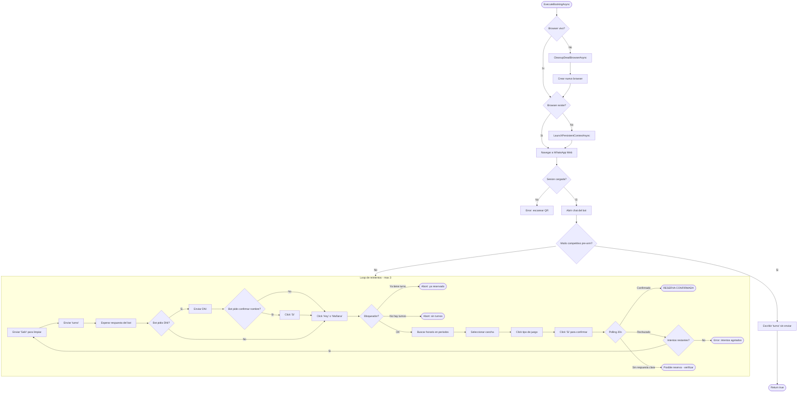
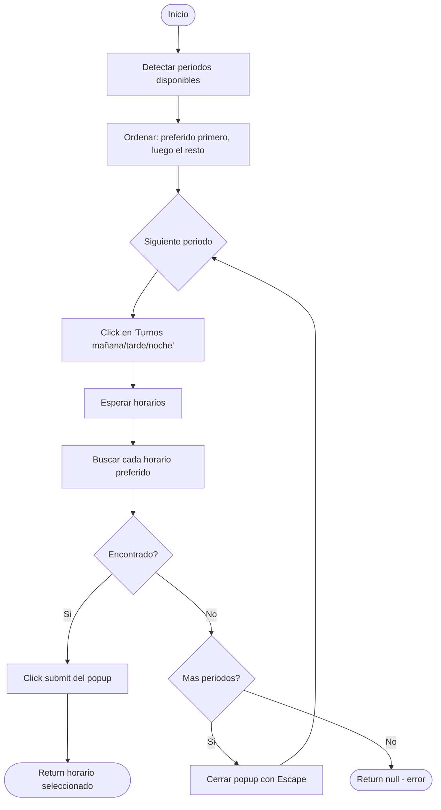

# Flujo de reserva

Documentacion tecnica del flujo completo de `ExecuteBookingAsync` en `WhatsAppAutomationService`.

---

## Diagrama general



---

## Detalle paso a paso

### Paso 0: Health check del browser

Antes de todo, se verifica que el browser existente siga vivo:

```csharp
if (_browserContext != null)
{
    try { await testPage.EvaluateAsync("() => true"); }
    catch { await CleanupDeadBrowserAsync(); }
}
```

Si el browser fue cerrado entre ejecuciones, se limpia y se recrea en este mismo intento.

### Paso 1: Asegurar browser

Si `_browserContext` es null, se crea un nuevo browser con persistent context:
- `Headless = false` (obligatorio para WhatsApp).
- `--disable-blink-features=AutomationControlled` (anti-deteccion).
- Viewport 1280x900.
- User data en `Data/browser-data/`.

### Paso 2: Navegar a WhatsApp Web

Se navega a `https://web.whatsapp.com` y se espera hasta 30 segundos a que aparezca la lista de chats (multiples selectores). Si no carga, se intenta con JavaScript como fallback. Si falla, se aborta con "Sesion no disponible".

### Paso 3: Abrir chat del bot

Se navega directamente a `https://web.whatsapp.com/send?phone={numero}`, que abre el chat con el bot. Se espera hasta que aparezca el compose box.

### Paso 4 (modo competitivo): Pre-arm

Si `competitivePreArm = true`, se escribe "turno" en el compose box **sin presionar Enter** y se retorna `true`. El scheduler se encarga de enviar despues.

### Paso 5: Limpieza de conversacion pendiente

`ClearPendingConversationAsync` envia "Salir" al bot hasta 2 veces para resetear cualquier conversacion previa. Detecta si el bot volvio al menu principal buscando frases como "como puedo ayudarte" o "pedir turno".

### Paso 6: Enviar "turno"

Cuenta mensajes entrantes antes de enviar, envia "turno", y espera hasta que el conteo de `message-in` aumente (hasta 15 segundos). Si el conteo no cambia, espera 5 segundos extra como fallback.

### Paso 7: DNI (condicional)

Busca en los ultimos 5 mensajes si el bot pidio "documento" o "dni". Si lo encuentra y hay DNI configurado:
1. Envia el DNI.
2. Espera respuesta.
3. Si el bot pregunta "A nombre de...", clickea "Si" para confirmar.

### Paso 8: Seleccionar dia

Clickea "Hoy" o "Mañana" (segun `config.BookingDay`) en los ultimos 5 mensajes. Espera respuesta del bot.

### Paso 9: Verificar bloqueadores

Busca en los ultimos 5 mensajes:
- **"Ya tiene turno reservado"**: aborta con estado `Completed` (no es un error, ya tenes reserva).
- **"No hay turnos disponibles"**: aborta con estado `Completed`.

### Paso 10: Seleccionar horario (multi-periodo)

Este es el paso mas complejo. `SelectTimeSlotAcrossPeriodsAsync`:



Para cada periodo:
1. Detecta que periodos estan visibles en el chat (`DetectAvailablePeriodsAsync`).
2. Ordena: preferido primero, luego los demas.
3. Para cada periodo: clickea el boton, abre el popup de horarios, busca cada horario preferido.
4. Si encuentra uno, lo selecciona y clickea el boton de envio del popup.
5. Si no encuentra en ese periodo, cierra el popup con Escape y prueba el siguiente.
6. Si ningun horario preferido esta disponible en ningun periodo: error.

### Paso 11: Seleccionar cancha

Similar al horario pero con fallback:
1. Intenta abrir popup de lista de canchas.
2. Prueba cada cancha preferida en orden.
3. Si ninguna esta disponible, `FindFirstAvailableOptionAsync` selecciona la primera que encuentre.
4. Clickea el boton de envio del popup.

### Paso 12: Seleccionar tipo de juego

Clickea "Single" o "Doble" en los ultimos 5 mensajes.

### Paso 13: Confirmar reserva

Clickea "Si" (o "Si", "Confirmar" como fallback) en los ultimos mensajes.

### Paso 14: Verificar resultado

Polling de hasta 20 segundos, cada 2 segundos:
- Revisa si hay mensaje de **rechazo** de cancha (alguien la tomo antes).
- Revisa si hay mensaje de **confirmacion** ("confirmad", "exito", "reservado").
- Si hay rechazo y quedan intentos → reintenta todo el flujo desde el paso 5.
- Si hay confirmacion → exito.
- Si pasan 20 segundos sin ninguno → "posible reserva, verificar manualmente".

---

## Reintentos

### Cancha rechazada (hasta 3 intentos)

Si despues de confirmar, el bot dice que la cancha no esta disponible:
1. Log "CANCHA RECHAZADA".
2. Si `attempt < 3`, vuelve al paso 5 (limpieza + turno + todo de nuevo).
3. Si se agotan los 3 intentos, error final.

### Browser cerrado (hasta 1 reintento)

Si una excepcion indica que el browser fue cerrado (`IsBrowserClosedException`):
1. `CleanupDeadBrowserAsync()` limpia todo.
2. El loop externo (`for browserAttempt`) reintenta con un browser nuevo.
3. Solo 1 reintento de browser. Si vuelve a fallar, error final.

---

## Timings clave

| Accion | Timeout/Delay |
|---|---|
| Navegar a WhatsApp Web | 30s timeout |
| Esperar carga de sesion | 30s timeout |
| Abrir chat del bot | 20s timeout |
| Esperar respuesta del bot (general) | 15-20s timeout |
| Polling de botones (`ClickButtonInRecentMessagesAsync`) | 2s-30s segun contexto |
| Delay entre reintento de cancha rechazada | 2s |
| Delay despues de abrir popup | 1.5s |
| Delay fallback si conteo no funciona | 8s |
| Polling de confirmacion final | 20s (cada 2s) |
| Extra wait despues de detectar respuesta | 1-1.5s |
