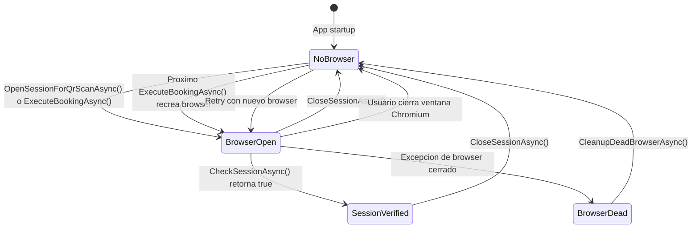

# Playwright — Guia completa

## Como esta integrado

Platz Daemon usa [Microsoft.Playwright](https://playwright.dev/dotnet/) version 1.51 (paquete NuGet) para controlar un navegador Chromium que interactua con WhatsApp Web.

La integracion vive en `Services/WhatsAppAutomationService.cs`, que es el unico archivo que importa `Microsoft.Playwright`.

### Persistent context

En vez de un browser regular, se usa un **persistent context** (`LaunchPersistentContextAsync`). Esto significa que todos los datos del navegador (cookies, localStorage, IndexedDB, service workers) se guardan en `Data/browser-data/` y sobreviven entre reinicios de la app.

Sin esto, WhatsApp Web pediria escanear el QR cada vez que se abre el browser.

```csharp
_browserContext = await _playwright.Chromium.LaunchPersistentContextAsync(
    _browserDataPath,
    new BrowserTypeLaunchPersistentContextOptions
    {
        Headless = false,
        Channel = "chromium",
        Args = new[] { "--disable-blink-features=AutomationControlled" },
        ViewportSize = new ViewportSize { Width = 1280, Height = 900 }
    });
```

### Por que Headless = false

WhatsApp Web tiene deteccion de navegadores headless. Si se intenta en modo headless:
- La pagina no carga correctamente.
- Se pide escanear QR aunque haya sesion guardada.
- En algunos casos, WhatsApp muestra un error generico.

Por eso Chromium siempre se abre con ventana visible. El usuario puede cerrar la ventana; se re-crea automaticamente en la proxima ejecucion.

### --disable-blink-features=AutomationControlled

Este flag evita que Chromium setee `navigator.webdriver = true`. Sin este flag, sitios como WhatsApp Web pueden detectar que el navegador esta siendo controlado por automatizacion y comportarse diferente.

---

## Ciclo de vida del navegador



### Deteccion de browser cerrado

Si el usuario cierra la ventana de Chromium (o si crashea), Playwright lanza excepciones como "Target closed" o "Browser has been closed". El metodo `IsBrowserClosedException` detecta estas:

```csharp
internal static bool IsBrowserClosedException(Exception ex)
{
    var msg = ex.Message.ToLowerInvariant();
    return msg.Contains("target closed") ||
           msg.Contains("browser has been closed") ||
           msg.Contains("connection disposed") ||
           // ... mas variantes
           ex is PlaywrightException pe && pe.Message.Contains("closed");
}
```

Cuando se detecta:
1. `CleanupDeadBrowserAsync()` limpia el contexto y la instancia de Playwright.
2. Se reintenta la operacion con un browser nuevo (hasta 1 retry).

### Health check proactivo

Antes de cada `ExecuteBookingAsync`, se verifica que el browser existente siga vivo:

```csharp
if (_browserContext != null)
{
    try { await testPage.EvaluateAsync("() => true"); }
    catch { await CleanupDeadBrowserAsync(); }
}
```

Si falla, se limpia y se crea uno nuevo, todo dentro del mismo intento de reserva.

---

## Selectores y estrategias de fallback

WhatsApp Web cambia su estructura DOM sin previo aviso. Por eso, el servicio usa **multiples estrategias** para cada operacion.

### Detectar sesion activa

`CheckSessionAsync` prueba 10 selectores CSS secuencialmente:

```
[data-testid='chat-list']
[data-testid='chatlist']
div#pane-side
[data-testid='chat-list-search']
[data-testid='search']
div[contenteditable='true'][data-tab='3']
[data-testid='chatlist-header']
[data-testid='conversation-compose-box-input']
div[role='navigation']
header[data-testid='chatlist-header-bar']
```

Si ninguno funciona, hace una evaluacion JavaScript que busca `#pane-side`, `[role="listitem"]`, y verifica el titulo de la pagina.

### Contar mensajes

`GetMessageCountAsync` usa 6 estrategias, en orden de prioridad:

| Prioridad | Selector | Que cuenta |
|---|---|---|
| 1 (primario) | `[class*="message-in"]` | Mensajes entrantes (del bot). Evita inflar el conteo con mensajes salientes por clicks en botones. |
| 2 | `[class*="message-out"]` | Mensajes salientes (debug only, no se usa para conteo). |
| 3 | `[data-id]` | Mensajes con ID de WhatsApp (prefijo `true_` o `false_`). |
| 4 | `.focusable-list-item` | Items focalizables. |
| 5 | `[role="row"]` | Filas en la lista de mensajes. |
| 6 | Panel children | Hijos directos del contenedor de conversacion. |

El conteo primario (`message-in`) es el mas confiable porque:
- Cuando se clickea un boton del bot, WhatsApp genera un `message-out` instantaneamente (incrementando el conteo total).
- Si contaramos total de mensajes, `WaitForBotResponseAsync` volveria prematuramente antes de que el bot realmente responda.
- Contando solo `message-in`, esperamos correctamente a una respuesta real del bot.

### Clickear botones

`ClickButtonInRecentMessagesAsync` busca en los ultimos N mensajes con tres pasadas:

1. **Match exacto**: normaliza emojis (ej: "✅Si" → "si") y compara.
2. **Word-boundary contains**: `"si"` matchea en "✅Si" pero NO en "👤Single".
3. **Spans**: busca cualquier `<span>` visible con el texto.

Antes de buscar en mensajes, tambien revisa popups abiertos:
- Radio buttons por `aria-label`.
- Gridcells con texto → click en el radio de la misma fila.
- Selectores legacy (`data-testid="list-msg-title"`, `role="option"`).

### Abrir popups de lista

`TryOpenListPopupInRecentAsync` busca el boton de lista con tres estrategias:

1. `[data-icon="list-msg-icon"]` — el icono ≡ dentro de botones de lista (mas confiable).
2. `[data-testid="list-msg-action"]` — selectores legacy.
3. Buttons con keywords: "ver opciones", "seleccionar", "canchas", "turnos".

---

## Debugging

### Desde el dashboard

Los logs en el dashboard son la primera herramienta de diagnostico. El servicio logea extensivamente:
- Conteos de mensajes antes/despues de cada accion.
- Resultado de cada click (incluyendo la estrategia que funciono).
- Contenido visible cuando un boton no se encuentra (`LogVisibleOptionsAsync`).

### LogVisibleOptionsAsync

Si un boton no se encuentra, el sistema loguea todo el contenido visible en el chat:

```
DEBUG - Contenido visible en chat (horario) [12 elementos]:
  > "📋 [radio] 18:00hs"
  > "📋 [radio] 19:00hs"
  > "📋 [gridcell] 17:30hs"
  > "🔘 Ver opciones"
```

Esto permite entender exactamente que ve el browser y por que no matchea.

### Playwright Debug Mode

Para debugging avanzado con breakpoints visuales:

```bash
# Windows
$env:PWDEBUG=1; dotnet run

# Linux/macOS
PWDEBUG=1 dotnet run
```

Esto abre Playwright Inspector, que permite:
- Ver selectores en tiempo real.
- Pausar la ejecucion antes de cada accion.
- Inspeccionar el DOM del browser.

> Nota: `PWDEBUG=1` ralentiza la ejecucion significativamente. Solo usarlo para diagnostico puntual.

### Playwright Trace

Para capturar un trace completo (screenshots, DOM snapshots, network):

```csharp
await _browserContext.Tracing.StartAsync(new()
{
    Screenshots = true,
    Snapshots = true,
    Sources = true
});
// ... ejecutar el flujo ...
await _browserContext.Tracing.StopAsync(new() { Path = "trace.zip" });
```

Luego abrir con: `npx playwright show-trace trace.zip`

> Esto requiere modificar temporalmente el codigo. No esta implementado como feature permanente.

---

## Instalacion de navegadores

Playwright necesita un browser descargado localmente. No usa Chrome del sistema.

### Auto-instalacion en el EXE publicado

A partir de v1.5, la app instala Chromium automaticamente la primera vez que se conecta WhatsApp. El metodo `EnsureBrowserInstalledAsync()` en `WhatsAppAutomationService` llama a `Microsoft.Playwright.Program.Main(new[] { "install", "chromium" })` antes de cada `Playwright.CreateAsync()`. Si Chromium ya esta instalado, retorna inmediatamente sin descargar nada.

Esto significa que el usuario final **no necesita ejecutar ningun comando manual**. La primera ejecucion tarda unos segundos extra (~100 MB de descarga).

### Por que no se usa IncludeNativeLibrariesForSelfExtract

Al publicar como single-file (`PublishSingleFile=true`), la propiedad `IncludeNativeLibrariesForSelfExtract=true` empaqueta los binarios nativos **dentro** del EXE. Esto incluye el driver Node.js de Playwright (`.playwright/node/win32_x64/node.exe`).

El problema es que Playwright busca el driver en disco, en `AppContext.BaseDirectory + ".playwright/..."`. Si `node.exe` esta empaquetado dentro del EXE, no existe en disco y Playwright falla con:

```
Driver not found: D:\.playwright\node\win32_x64\node.exe
```

**Solucion**: no usar `IncludeNativeLibrariesForSelfExtract`. Los archivos nativos (incluyendo `.playwright/`) quedan como archivos sueltos al lado del EXE. Todo se empaqueta en el ZIP de release y el usuario extrae y ejecuta igual que antes.

### En desarrollo

```bash
# Despues de dotnet build
pwsh bin/Debug/net10.0/playwright.ps1 install chromium
```

### En publicacion

```bash
pwsh bin/Release/net10.0/<rid>/publish/playwright.ps1 install chromium
```

### En CI

En GitHub Actions, se necesita instalar Playwright antes de correr tests que usen el browser. Pero como los tests actuales no ejecutan Playwright (el servicio esta excluido de coverage), no es necesario en el CI pipeline actual.

Si en el futuro se agregan tests de integracion con browser real:

```yaml
- name: Install Playwright browsers
  run: pwsh bin/Release/net10.0/playwright.ps1 install chromium --with-deps
```

El flag `--with-deps` instala las dependencias del sistema operativo (librerias de X11 en Linux).

---

## Como extender para nuevas versiones de WhatsApp Web

WhatsApp Web actualiza su DOM periodicamente. Cuando algo deja de funcionar:

1. **Diagnostico**: revisar los logs del dashboard. `LogVisibleOptionsAsync` muestra que ve el browser.

2. **Identificar el selector roto**: los logs indican cual estrategia se esta intentando y cual falla (ej: `NOT_FOUND:class:msgs=42:recent=5`).

3. **Inspeccionar el DOM actual**: abrir WhatsApp Web manualmente en Chrome, usar DevTools (F12) para encontrar los nuevos selectores.

4. **Agregar fallback**: nunca eliminar selectores viejos. Agregar los nuevos como fallback adicional. WhatsApp Web puede tener multiples versiones activas simultaneamente.

5. **Testear**: ejecutar una reserva manual desde el dashboard y verificar que cada paso funcione.

### Ejemplo: agregar un nuevo selector de conteo de mensajes

En `GetMessageCountAsync`, agregar una nueva estrategia:

```javascript
// Dentro del EvaluateAsync, agregar:
const byNewSelector = main.querySelectorAll('[data-testid="new-msg-container"]').length;
```

Y luego incluirlo en el array de retorno y en la logica de fallback en C#.
