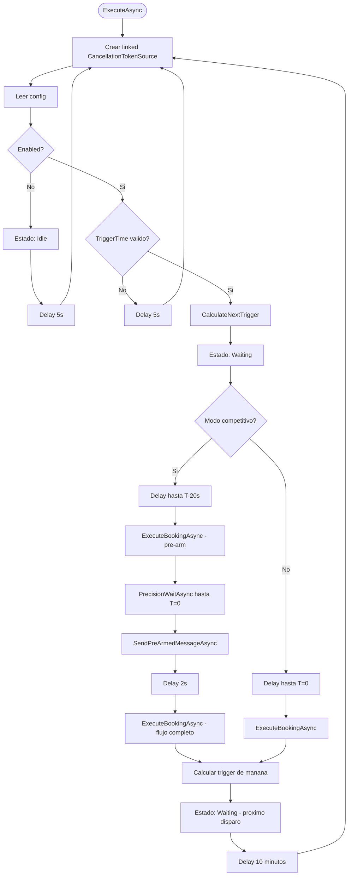

# Scheduler y Timing

## BackgroundService

`BookingSchedulerService` extiende `BackgroundService`, una clase base de ASP.NET Core que ejecuta logica en background durante toda la vida de la aplicacion.

Se registra en `Program.cs` de dos formas:
1. `AddSingleton<BookingSchedulerService>()` — para que las Razor Pages lo inyecten.
2. `AddHostedService(sp => sp.GetRequiredService<BookingSchedulerService>())` — para que ASP.NET Core lo arranque al iniciar.

El metodo `ExecuteAsync` contiene un loop infinito que corre hasta que la aplicacion se detenga.

---

## Loop principal



### Manejo de excepciones en el loop

| Excepcion | Comportamiento |
|---|---|
| `OperationCanceledException` (config changed) | Re-entra al loop, re-lee config |
| `OperationCanceledException` (app shutdown) | Sale del loop (`break`) |
| Cualquier otra | Log error, estado Error, espera 30s, re-entra |

---

## Zona horaria

Toda la logica de scheduling usa **hora Argentina (UTC-3)**.

`ResolveArgentinaTimeZone()` resuelve el timezone cross-platform:

```csharp
private static TimeZoneInfo ResolveArgentinaTimeZone()
{
    // Windows usa IDs de Microsoft
    if (TimeZoneInfo.TryFindSystemTimeZoneById("Argentina Standard Time", out var tz))
        return tz;
    // Linux/macOS usan IDs IANA
    if (TimeZoneInfo.TryFindSystemTimeZoneById("America/Argentina/Buenos_Aires", out tz))
        return tz;
    // Fallback manual: UTC-3 fijo (Argentina no tiene horario de verano)
    return TimeZoneInfo.CreateCustomTimeZone("AR", TimeSpan.FromHours(-3), "Argentina", "Argentina");
}
```

El resultado se guarda en un campo `static readonly` para evitar resolver el timezone en cada iteracion.

Cada vez que se necesita la hora actual, se convierte desde UTC:

```csharp
var now = TimeZoneInfo.ConvertTimeFromUtc(DateTime.UtcNow, ArgentinaTimeZone);
```

> **Nota**: Argentina no tiene horario de verano (DST) desde 2009, por lo que UTC-3 fijo funciona correctamente como fallback.

---

## Calculo del proximo disparo

`CalculateNextTrigger(now, triggerTimeOfDay)`:

```csharp
var todayTrigger = now.Date + triggerTimeOfDay;
if (now > todayTrigger.AddMinutes(5))
    todayTrigger = todayTrigger.AddDays(1);
return todayTrigger;
```

### Gracia de 5 minutos

Si la app se reinicia justo despues de la hora de disparo (ej: trigger a las 08:00, reinicio a las 08:03), todavia intenta disparar hoy. Esto previene que un restart accidental cause que se pierda la reserva del dia.

Despues de 5 minutos (ej: 08:06), se programa para manana.

### Despues de la ejecucion

Inmediatamente despues de ejecutar la reserva, se calcula el proximo disparo para manana:

```csharp
var tomorrowTrigger = nextNow.Date.AddDays(1) + triggerTimeOfDay;
```

Esto actualiza el countdown del dashboard via `AppStateService.SetNextRun()` y `UpdateStatusAsync`.

---

## Modo competitivo

El modo competitivo optimiza la velocidad para situaciones de alta competencia por las canchas.

### Timeline

```
T-20s: Pre-arm
  ├── Abrir/reusar Chromium
  ├── Navegar al chat del bot
  ├── Escribir "turno" en el compose box (sin Enter)
  └── Mensaje queda "armado"

T=0: Disparo
  ├── PrecisionWaitAsync finaliza
  ├── SendPreArmedMessageAsync → presiona Enter
  └── "turno" se envia al bot

T+2s: Flujo completo
  └── ExecuteBookingAsync(competitivePreArm: false)
      └── (el bot ya esta respondiendo a "turno")
```

### Pre-arm

`ExecuteBookingAsync(competitivePreArm: true)`:
1. Asegura que el browser este abierto.
2. Navega a WhatsApp Web.
3. Verifica la sesion.
4. Abre el chat del bot.
5. Escribe "turno" con `TypeMessageAsync` (que clickea el compose box y tipea sin Enter).
6. Retorna `true`.

### Precision wait

`PrecisionWaitAsync(targetTime, ct)` usa tres fases para maxima precision:

```
Fase 1: Sleep grueso (>1s restante)
  └── Task.Delay(500ms) en loop
      └── Precision: ~500ms

Fase 2: Sleep fino (100ms - 1s restante)
  └── Task.Delay(10ms) en loop
      └── Precision: ~10ms

Fase 3: Busy-wait (<50ms restante)
  └── Task.Yield() en loop
      └── Precision: <1ms (depende del scheduler del OS)
```

La fase 1 minimiza CPU usage durante la espera larga. La fase 2 empieza a polling mas frecuente. La fase 3 usa busy-wait (consumo alto de CPU por <50ms) para maxima precision en el momento critico.

### Envio del mensaje pre-armado

`SendPreArmedMessageAsync()` simplemente presiona Enter en la pagina:

```csharp
await page.Keyboard.PressAsync("Enter");
```

El mensaje "turno" ya estaba escrito en el compose box, asi que Enter lo envia.

### Flujo post-envio

Despues de enviar, se espera 2 segundos y se ejecuta `ExecuteBookingAsync(competitivePreArm: false)`. Este flujo completo:
1. No re-abre el browser (ya esta abierto).
2. No re-navega a WhatsApp Web (ya esta ahi).
3. Empieza desde la limpieza de conversacion pendiente.
4. Re-envia "turno" y sigue el flujo normal.

> El re-envio de "turno" es redundante si el primer envio ya disparo una respuesta del bot. Pero es seguro porque `ClearPendingConversationAsync` resetea la conversacion antes.

---

## Reactividad a cambios de configuracion

### Problema

Si el usuario cambia la hora de disparo en `/Sistema` (ej: de 08:00 a 09:00), el scheduler podria estar en un `Task.Delay` largo esperando las 08:00. Sin intervencion, el nuevo horario no se aplicaria hasta el dia siguiente.

### Solucion

Se usa un `CancellationTokenSource` vinculado (`CreateLinkedTokenSource`) que combina:
- El `stoppingToken` de la app (para shutdown).
- Un token propio que se cancela cuando la config cambia.

```csharp
_configCts = CancellationTokenSource.CreateLinkedTokenSource(stoppingToken);
var loopToken = _configCts.Token;
await Task.Delay(waitUntilTrigger, loopToken);  // ← se puede cancelar
```

Cuando `SistemaModel.OnPostAsync` llama a `_scheduler.NotifyConfigChanged()`:

```csharp
public void NotifyConfigChanged()
{
    try { _configCts?.Cancel(); }
    catch (ObjectDisposedException) { }
}
```

El `Task.Delay` lanza `OperationCanceledException`, que el loop del scheduler captura:

```csharp
catch (OperationCanceledException) when (!stoppingToken.IsCancellationRequested)
{
    // Config changed — re-enter loop to pick up new values
    await _log.LogInfoAsync("Configuracion actualizada. Recalculando...");
}
```

Y re-entra al loop, donde crea un nuevo CTS, re-lee la config, y calcula el nuevo disparo.
