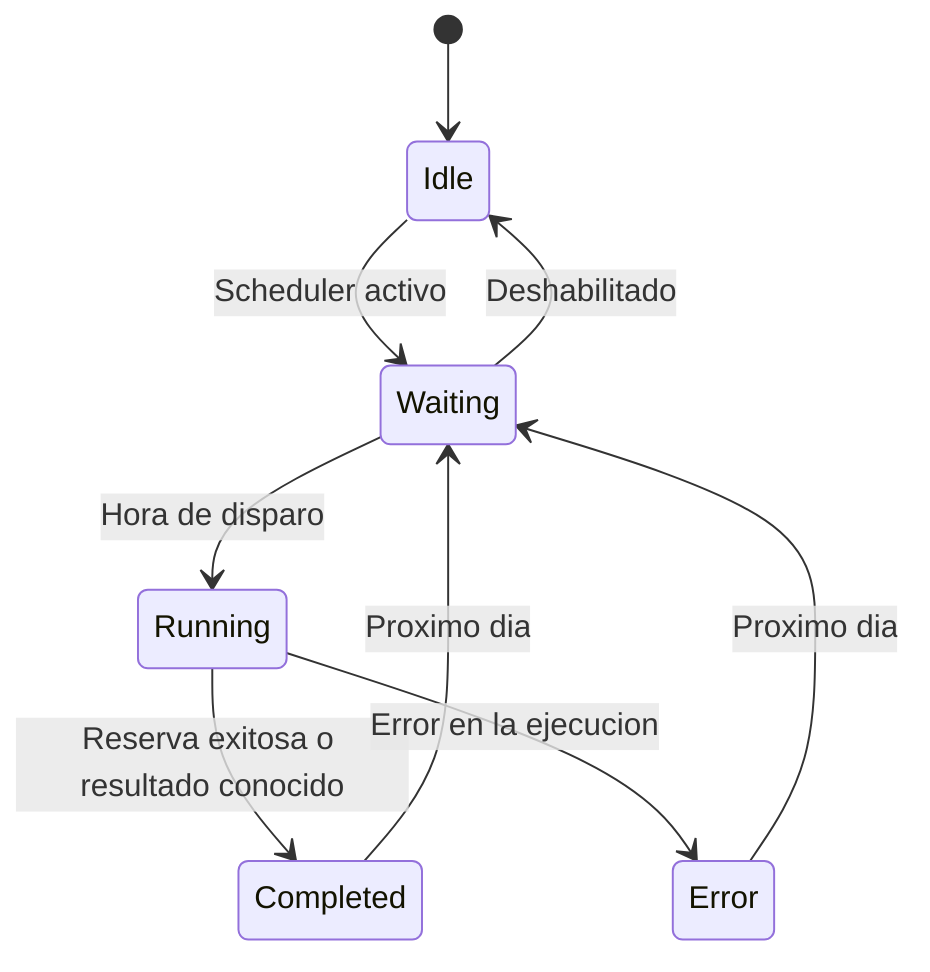

# Servicios — Deep dive

Todos los servicios se registran como **Singleton** en `Program.cs`. Esta seccion documenta cada uno en profundidad.

---

## WhatsAppAutomationService

**Archivo**: `Services/WhatsAppAutomationService.cs` (~1900 lineas)
**Responsabilidad**: Controlar un navegador Chromium via Playwright para interactuar con WhatsApp Web.

### Estado interno

| Campo | Tipo | Descripcion |
|---|---|---|
| `_playwright` | `IPlaywright?` | Instancia de Playwright (null cuando no hay browser activo) |
| `_browserContext` | `IBrowserContext?` | Contexto del navegador persistente (mantiene sesion) |
| `_browserDataPath` | `string` | Ruta a `Data/browser-data/` donde se guardan cookies y sesion |
| `_lock` | `SemaphoreSlim(1,1)` | Serializa acceso al browser — solo una operacion a la vez |
| `_env` | `IWebHostEnvironment` | Para resolver `ContentRootPath` |
| `_log` | `LogStore` | Para emitir logs visibles en el dashboard |
| `_configStore` | `IConfigStore` | Para leer configuracion durante la ejecucion |
| `_appState` | `AppStateService` | Para actualizar el estado del daemon |

### Propiedades publicas

- `IsSessionActive`: `true` si hay un browser context abierto.
- `HasSavedSessionData`: `true` si `Data/browser-data/` tiene archivos. Indica que la sesion puede restaurarse sin QR.

### Metodos publicos

| Metodo | Descripcion |
|---|---|
| `OpenSessionForQrScanAsync()` | Abre Chromium con WhatsApp Web para escanear QR. Cierra cualquier sesion previa. |
| `CheckSessionAsync()` | Verifica si WhatsApp Web esta logueado usando multiples selectores CSS + evaluacion JS. |
| `CloseSessionAsync()` | Cierra el browser y limpia estado. |
| `ExecuteBookingAsync(bool competitivePreArm)` | Ejecuta el flujo completo de reserva. Si `competitivePreArm=true`, solo pre-carga el mensaje sin enviarlo. |
| `SendPreArmedMessageAsync()` | Envia el mensaje pre-cargado (presiona Enter). Usado por el scheduler en modo competitivo. |

### Metodos privados (helpers)

El servicio tiene ~25 metodos privados organizados en bloques:

**Navegacion y mensajes:**
- `OpenBotChatAsync`: navega a `https://web.whatsapp.com/send?phone=...`
- `TypeMessageAsync`: escribe texto en el compose box sin enviar.
- `SendMessageAsync`: escribe + Enter.
- `ScrollToBottomAsync`: hace scroll al fondo del chat.

**Conteo y espera:**
- `GetMessageCountAsync`: cuenta mensajes entrantes (`message-in`) usando 6 estrategias de fallback.
- `WaitForBotResponseAsync`: polling hasta que el conteo de mensajes entrantes aumente. Fallback a delay de 8s si el conteo no funciona.

**Interaccion con botones:**
- `ClickButtonInRecentMessagesAsync`: busca y clickea un boton por texto en los ultimos N mensajes. Usa 3 pasadas: match exacto, word-boundary, y spans. Tambien busca en popups abiertos (radio buttons, gridcells).
- `TryOpenListPopupInRecentAsync`: abre un popup de lista (ej: horarios, canchas) buscando el icono `list-msg-icon` o botones con keywords.
- `TryClickListSubmitAsync`: clickea el boton de envio (verde) del popup. Busca por `data-icon`, `data-testid`, y texto.
- `FindFirstAvailableOptionAsync`: selecciona la primera opcion disponible en un popup (fallback de canchas).
- `ClickPeriodButtonAsync`: intenta clickear un boton de periodo con multiples variantes de texto.

**Deteccion de estado:**
- `CheckForDniRequestInRecentAsync`: detecta si el bot pidio DNI en los ultimos 5 mensajes.
- `CheckForNameConfirmationInRecentAsync`: detecta "A nombre de..." para confirmar identidad.
- `CheckForBookingBlockerAsync`: detecta "ya tiene turno" o "no hay turnos disponibles".
- `CheckForCourtRejectionAsync`: detecta rechazo de cancha al confirmar.
- `CheckForConfirmationInRecentAsync`: detecta mensaje de confirmacion exitosa.

**Seleccion multi-periodo:**
- `SelectTimeSlotAcrossPeriodsAsync`: intenta encontrar un horario en todos los periodos, empezando por el preferido.
- `DetectAvailablePeriodsAsync`: escanea los mensajes para detectar que periodos ofrece el bot.
- `SelectTimeSlotAsync`: busca un horario especifico en el popup abierto.
- `SelectCourtAsync`: busca una cancha preferida o toma la primera disponible.
- `CloseTimeSlotPopupAsync`: cierra el popup con Escape.

**Diagnostico:**
- `LogVisibleOptionsAsync`: loguea todo el contenido visible en el chat (botones, spans, radio buttons, gridcells). Herramienta de debugging.

**Browser health:**
- `IsBrowserClosedException`: detecta excepciones causadas por cierre externo del browser.
- `CleanupDeadBrowserAsync`: limpia un browser muerto para permitir recreacion.
- `CloseSessionInternalAsync`: cierra browser y playwright sin adquirir el lock (uso interno).

### Patron de JavaScript inline

Muchos metodos evaluan JavaScript directamente en la pagina de WhatsApp Web via `page.EvaluateAsync`. Esto es necesario porque:

1. Los selectores de Playwright no son suficientes para la complejidad del DOM de WhatsApp.
2. Se necesitan multiples estrategias de fallback en una sola evaluacion atomica.
3. Se requiere logica condicional dentro del DOM (ej: buscar solo en los ultimos 5 mensajes).

El JS inline esta embebido como strings C# con `@"..."`. Es la parte mas fragil del sistema — ver [maintenance.md](maintenance.md) para detalles.

### Concurrencia

El `SemaphoreSlim(1,1)` garantiza que:
- No se puede abrir el browser mientras se esta ejecutando una reserva.
- No se pueden ejecutar dos reservas simultaneamente.
- El scheduler y la ejecucion manual no se pisan.

**Advertencia**: si un metodo se cuelga dentro del lock (ej: timeout de Playwright), bloquea todas las operaciones de automatizacion hasta que el timeout expire.

---

## BookingSchedulerService

**Archivo**: `Services/BookingSchedulerService.cs` (~210 lineas)
**Responsabilidad**: `BackgroundService` que espera hasta la hora de disparo y lanza la reserva.

### Estado interno

| Campo | Tipo | Descripcion |
|---|---|---|
| `_configCts` | `CancellationTokenSource?` | Token vinculado al `stoppingToken` de la app. Se cancela cuando el usuario guarda config en /Sistema para re-calcular el disparo. |
| `ArgentinaTimeZone` | `TimeZoneInfo` (static) | Timezone Argentina resuelto cross-platform. |

### Loop principal (`ExecuteAsync`)

```
while (!stoppingToken.IsCancellationRequested):
  1. Crear linked CancellationTokenSource (config + stopping)
  2. Leer config
  3. Si deshabilitado → estado Idle, esperar 5s, continuar
  4. Parsear TriggerTime
  5. Calcular proximo disparo (CalculateNextTrigger)
  6. Actualizar estado: Waiting + proximo disparo
  7. Si modo competitivo:
     a. Esperar hasta T-20s
     b. Pre-armar mensaje (ExecuteBookingAsync con competitivePreArm=true)
     c. PrecisionWait hasta T=0
     d. Enviar mensaje pre-armado (SendPreArmedMessageAsync)
     e. Esperar 2s, ejecutar flujo completo
  8. Si modo normal:
     a. Esperar hasta T=0
     b. Ejecutar flujo completo (ExecuteBookingAsync)
  9. Calcular proximo disparo para manana
  10. Esperar 10 minutos antes de re-entrar al loop
```

### Reactividad a cambios de config

Cuando el usuario guarda en `/Sistema`, `SistemaModel.OnPostAsync` llama a `_scheduler.NotifyConfigChanged()`, que cancela el `_configCts`. Esto interrumpe cualquier `Task.Delay` en curso y hace que el loop re-lea la config inmediatamente.

### Calculo del proximo disparo

`CalculateNextTrigger(now, triggerTimeOfDay)`:
- Si `now` esta antes de `trigger + 5min` → disparo hoy.
- Si `now` esta despues de `trigger + 5min` → disparo manana.
- La gracia de 5 minutos permite que si la app se reinicia justo despues de la hora de disparo, todavia intente ejecutar hoy.

### Precision timing (modo competitivo)

`PrecisionWaitAsync` usa tres fases:
1. **>1s restante**: `Task.Delay(500ms)` — duerme la mayor parte.
2. **100ms-1s restante**: `Task.Delay(10ms)` — polling mas frecuente.
3. **<50ms restante**: `Task.Yield()` — busy-wait para precision de milisegundos.

---

## ConfigStore

**Archivo**: `Services/ConfigStore.cs` (~82 lineas)
**Responsabilidad**: Carga, cachea y persiste la configuracion en `Data/config.json`.

### Comportamiento

- **Startup**: lee `Data/config.json`. Si no existe o esta corrupto, usa defaults.
- **Get()**: devuelve el config cacheado en memoria (sin I/O).
- **SaveAsync()**: escribe a disco con `SemaphoreSlim`, actualiza cache.
- **Migracion**: `MigrateConfig` normaliza horarios sin suffix "hs" (ej: `"18:00"` → `"18:00hs"`).

### Formato JSON

El JSON usa `camelCase` (via `JsonNamingPolicy.CamelCase`) y esta indentado para legibilidad:

```json
{
  "botPhoneNumber": "93534407576",
  "dni": "12345678",
  "triggerTime": "08:00",
  "competitiveMode": true,
  "preferredPeriod": "Noche",
  "preferredTimeSlots": ["18:00hs", "19:00hs"],
  "preferredCourts": ["Cancha Central", "Cancha 9"],
  "gameType": "Doble",
  "bookingDay": "Hoy",
  "enabled": true
}
```

### Interfaz IConfigStore

Existe para permitir mocking en tests. Solo expone `Get()` y `SaveAsync()`.

---

## LogStore

**Archivo**: `Services/LogStore.cs` (~58 lineas)
**Responsabilidad**: Buffer circular de logs en memoria con broadcast via SignalR.

### Comportamiento

- Mantiene una lista de hasta **500** `LogEntry` en memoria.
- Al superar 500, elimina el mas viejo (`RemoveAt(0)`).
- Cada log nuevo se envia via SignalR a todos los clientes conectados:
  ```csharp
  await _hubContext.Clients.All.SendAsync("ReceiveLog",
      entry.FormattedTime, entry.Prefix, entry.Message, entry.CssClass);
  ```
- Provee shortcuts: `LogInfoAsync`, `LogSuccessAsync`, `LogWarningAsync`, `LogErrorAsync`.
- `Clear()` vacia la lista (llamado desde el boton "Limpiar logs" del dashboard).
- Usa `Lock` (la nueva API de .NET) para proteger la lista.

### Niveles de log

| Nivel | Prefijo | CSS Class | Color |
|---|---|---|---|
| Info | `[INFO]` | `log-info` | Verde (#33ff33) |
| Success | `[OK]` | `log-success` | Verde claro (#00ff88) |
| Warning | `[WARN]` | `log-warning` | Amarillo (#ffcc00) |
| Error | `[ERR]` | `log-error` | Rojo (#ff3333) |

---

## AppStateService

**Archivo**: `Services/AppStateService.cs` (~51 lineas)
**Responsabilidad**: Mantiene el estado global de la aplicacion y lo notifica al frontend via SignalR.

### Estado (`AppState`)

| Propiedad | Tipo | Descripcion |
|---|---|---|
| `Status` | `DaemonStatus` | Estado actual: `Idle`, `Waiting`, `Running`, `Completed`, `Error` |
| `LastResult` | `string?` | Ultimo resultado (ej: "RESERVA CONFIRMADA - 18:00hs - Cancha 9") |
| `LastRunTime` | `DateTime?` | Cuando se ejecuto la ultima reserva |
| `NextRunTime` | `DateTime?` | Proximo disparo programado |
| `WhatsAppConnected` | `bool` | Si hay una sesion de WhatsApp activa |

### Maquina de estados



### Broadcast

`UpdateStatusAsync` envia un evento SignalR `StatusUpdate` con:
- El status como string.
- El ultimo resultado.
- El ISO string del proximo disparo (para el countdown del frontend).

---

## LogHub

**Archivo**: `Hubs/LogHub.cs` (~13 lineas)
**Responsabilidad**: Hub de SignalR para comunicacion real-time.

Es un hub **minimal** que solo define `OnConnectedAsync` (override vacio). No tiene metodos invocables desde el cliente.

Toda la logica de broadcast la hacen `LogStore` y `AppStateService` inyectando `IHubContext<LogHub>` y llamando a `Clients.All.SendAsync(...)` directamente.

Esta marcado con `[ExcludeFromCodeCoverage]` porque no tiene logica testeable — es infraestructura pura de SignalR.
